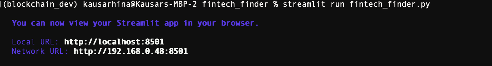
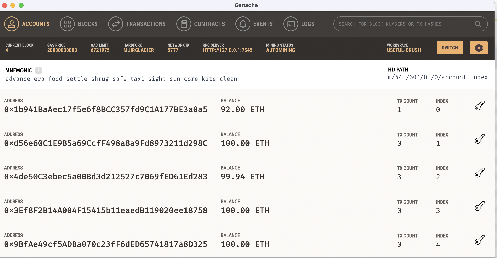
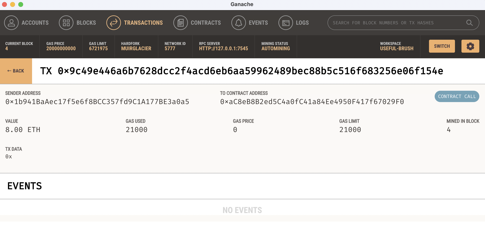

# fintech_finder

The **fintech_finder**  is an application that its customers can use to find fintech professionals from among a list of candidates, hire them, and pay them. 
---

## Technologies

This project leverages python 3.8.15 with the following packages:

* [Streamlit](https://streamlit.io/) - For web apps in minutes
* [Ganache](https://trufflesuite.com/ganache/)- For personal Ethereum blockchain which you can use to run tests, execute commands, and inspect state while controlling how the chain chain operates.


---

## Installation Guide

Before running the application first install the following dependencies in conda dev environment.

```python

    conda create -n dev python=3.8 anaconda

    python -m ipykernel install --user --name dev

    conda activate dev

    pip install -r requirements.txt

    conda deactivate 

```

---


## Usage

To use the **fintech_finder**  application simply clone the repository and run the **fintech_finder.py** with streamlit:

```python
    In the terminal, navigate to the project folder where the fintech_finder.py

    In the terminal, run the Streamlit application by

    streamlit run fintech_finder.py   
```


fintech_finder web app screen shots







---

## Contributors

Kausar Hina

---

## License

MIT


